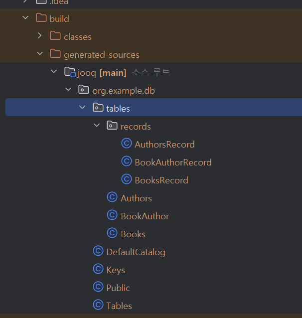

"# Quocard-coding-test" 

KR

1. 환경 설정
   JDK 설치: SDKMAN이나 asdf를 사용하여 JDK 21을 설치합니다.
   프로젝트 생성: Spring Initializr를 사용하여 Gradle 프로젝트를 생성합니다. Kotlin, JOOQ, Flyway, PostgreSQL Driver, Docker Compose Support 플러그인을 추가합니다.
   IDE 설정: IntelliJ IDEA에서 프로젝트를 열고 JDK와 Gradle 설정을 완료합니다.
2. 데이터베이스 설정
   compose.yaml 파일을 사용하여 PostgreSQL 컨테이너를 설정합니다.
   Flyway를 사용하여 데이터베이스 마이그레이션을 설정합니다.
   
3.  build.gradle.kts 파일에 jOOQ ,flyway설정 추가
   ```
        plugins {
         ...
         id("org.jooq.jooq-codegen-gradle") version  "3.19.11"
         id("org.flywaydb.flyway") version "10.10.0"
         ...
         }
        dependencies {
            ...
            implementation("org.flywaydb:flyway-core:10.10.0")
            implementation("org.flywaydb:flyway-postgresql:10.10.0")
            implementation("org.jooq:jooq:3.19.11")
            implementation("org.jooq:jooq-meta:3.19.11")
            implementation("org.jooq:jooq-codegen:3.19.11")
            ...
            }
        jooq {
          configuration {
      
              jdbc {
                  driver = "org.postgresql.Driver"
                  url = "jdbc:postgresql://localhost:5432/postgres"
                  user = "myuser"
                  password = "secret"
              }
              generator {
                  database {
                      name = "org.jooq.meta.postgres.PostgresDatabase"
                      inputSchema = "public"
                      includes = ".*"
                      excludes = "flyway_schema_history"
                  }
      
                  target {
                      packageName = "org.example.db"
                  }
               }
            }
         }
      
      sourceSets.main {
         java.srcDirs("build/generated-sources/jooq")
         }
      
      tasks.named("compileKotlin") {
         dependsOn(tasks.named("jooqCodegen"))
         }
      
      flyway {
         driver = "org.postgresql.Driver"
         url = "jdbc:postgresql://localhost:5432/postgres"
         user = "myuser"
         password = "secret"
         schemas = arrayOf("public")
         cleanDisabled = false
         }
      
      tasks.named("jooqCodegen") {
         dependsOn(tasks.named("flywayMigrate"))
         inputs.files(fileTree("src/main/resources/db/migration"))
         } 
```

4.OOQ Access Layer, Flyway Migration을 활용해서 엔티티 및 리포지토리 생성

   1. src/main/resources/db/migration 경로에 Flyway 마이그레이션 파일을 추가합니다.  V1__Create_books_and_authors.sql
      
   
   CREATE TABLE IF NOT EXISTS flyway_schema_history (
   installed_rank INT NOT NULL,
   version VARCHAR(50),
   description VARCHAR(200) NOT NULL,
   type VARCHAR(20) NOT NULL,
   script VARCHAR(1000) NOT NULL,
   checksum INT,
   installed_by VARCHAR(100) NOT NULL,
   installed_on TIMESTAMP DEFAULT CURRENT_TIMESTAMP NOT NULL,
   execution_time INT NOT NULL,
   success BOOLEAN NOT NULL
   );
   CREATE TABLE authors (
   id SERIAL PRIMARY KEY,
   name VARCHAR(255) NOT NULL,
   birth_date DATE NOT NULL
   );
   CREATE TABLE books (
   id SERIAL PRIMARY KEY,
   title VARCHAR(255) NOT NULL,
   price INT NOT NULL CHECK (price >= 0),
   status VARCHAR(50) NOT NULL
   );
   CREATE TABLE book_author (
   book_id BIGINT NOT NULL,
   author_id BIGINT NOT NULL,
   PRIMARY KEY (book_id, author_id),
   FOREIGN KEY (book_id) REFERENCES books(id),
   FOREIGN KEY (author_id) REFERENCES authors(id)
   );
   
   
   
   2. Flyway 마이그레이션을 실행하여 데이터베이스 테이블을 생성하고 jOOQ 코드 생성을 실행합니다.
   ```
   ./gradlew flywayMigrate
   ./gradlew jooqCodegen
   ``` 
   3. 잘 생성되었나 확인방법
   명령어를 실행한 후, build/generated-src/jooq 디렉토리에 jOOQ가 생성한 코드가 있는지 확인하세요. 생성된 코드가 있다면 성공적으로 실행된 것입니다.  또한, build/reports 디렉토리에서 Flyway와 jOOQ의 로그 파일을 확인하여 문제가 없는지 검토할 수 있습니다.
   
   [check docker db.md](check%20docker%20db.md)

4. 컨트롤러 클래스 생성
   5. src/main/kotlin/com/example/booknest/controller 경로에 컨트롤러 클래스를 생성합니다.